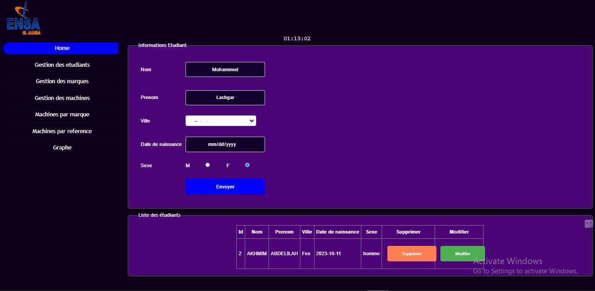
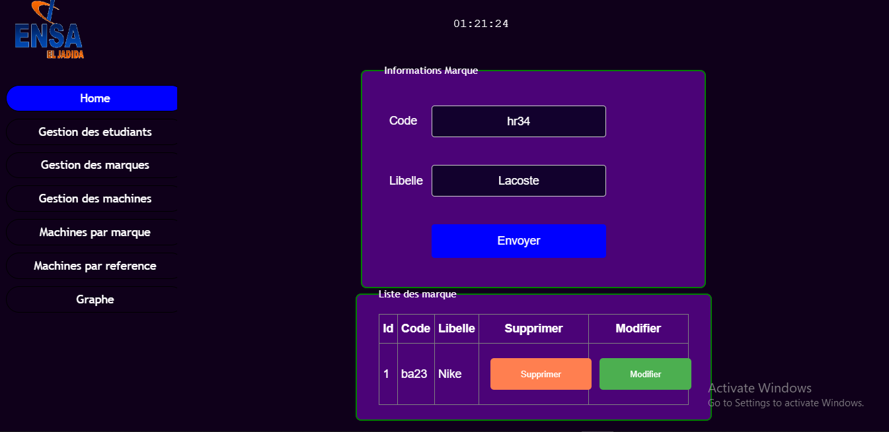
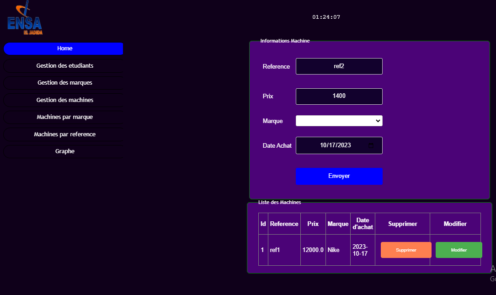
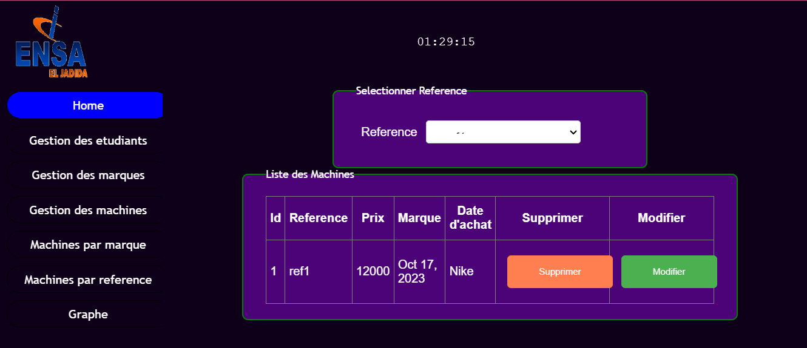
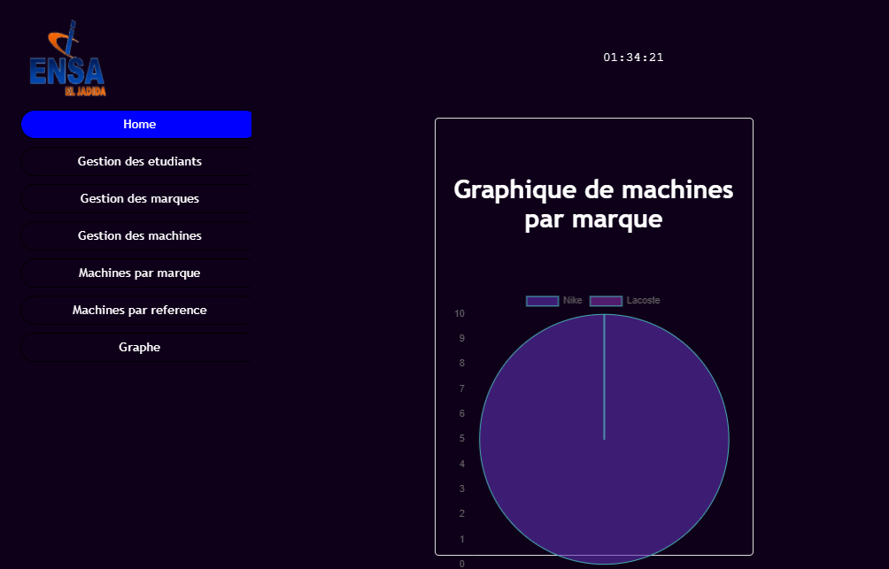

## Projet Java de Gestion des Etudiants, Machines et Marques

- **Gestion des etudiant :**

- **Gestion des marques :**

- **Gestion des machines :**

- **Recherche des references :**

- **Affichage des graphes :**

  
## les fonctionnalités implémentées
1. les operations CRUD pour les machines
3. trouver les machines existants

  
##Les Technologies Utilisées
+ MySQL
+ Hibernate
+ JSP
+ AJAX

"# TP-AJAX" 

#### Credit by "Akhmim Abdelilah"